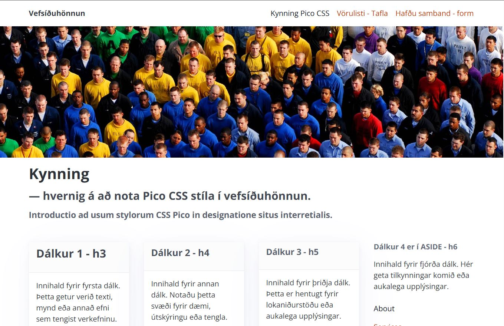
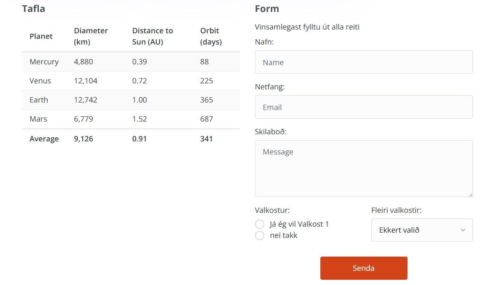
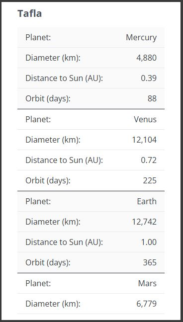

# CSS Starter Page - _CSS Boilerplate_

### Goals:
- Students gain an understanding of how to organize a stylesheet system and design a basic website (_boilerplate_).
- How to use variables in a CSS stylesheet.
- Design forms and tables in HTML.

When designing a website in a structured way, it helps to rely on a base system where all core elements needed for the site are already designed. This includes items such as a grid system, responsive design, color choices, and typography.

For this assignment, we use the **Pico** CSS framework, which can be used without custom classes. We will explore the framework and adapt it to our own design. First, let's look at how to use the framework.

- [Pico CSS framework](https://picocss.com/docs)

## Assignment 1

Create a website and connect the Pico framework to it. Download the full [_Pico_ package](https://github.com/picocss/pico/archive/refs/heads/main.zip) from their site. Add the contents to your development area and explore what can be done with the stylesheet framework.

1. Choose a color theme
   - [Colors](https://picocss.com/docs/colors)
   - ` <link rel="stylesheet" href="css/pico.<theme>.css"> `
1. Pico selects light or dark theme automatically based on the user's browser settings
   - [Light or dark color scheme](https://picocss.com/docs/color-schemes)

### Typography

- [Typography settings](https://picocss.com/docs/typography)
- [Links](https://picocss.com/docs/link)
- [Buttons](https://picocss.com/docs/button)

### Grid System (_layout_)

Pico comes with a simple column system and breakpoint system (_@media breakpoints_). Use the following classes to build the column layout.

- [Container](https://picocss.com/docs/container)
- [Grid](https://picocss.com/docs/grid)

### Navigation

- [Navigation (Nav)](https://picocss.com/docs/nav)

### Customizations

1. Get a different font from fonts.google.com and replace the default font used in Pico.

- [CSS variables](https://picocss.com/docs/css-variables)

#### Front Page Image

- Choose an image from an image library (_free choice_) and prepare it in three different sizes (in VEFTH1VG05AU, assignment 6 covered image editing with the Photopea app).
- Insert the front-page image in a ` picture ` tag on the website and use all three sizes:
  - **Large**
  - **Medium**
  - **Small**

Note that PICO does not include custom styles for image processing or other special needs.

- To use custom CSS styles, create an additional stylesheet named **_custom.css_** and link it in the HTML page together with Pico.
- The Pico stylesheet should come before _"custom.css"_ in HTML/Head:
  - ` <link rel="stylesheet" href="css/pico.<theme>.css"> `
  - ` <link rel="stylesheet" href="css/custom.css"> `

#### Table &lt;Table>

Create a table on the website. The table content can be any type of schedule/data listing.
The default HTML table layout is rigid unless custom solutions are used. In Pico, you can use [Overflow auto](https://picocss.com/docs/overflow-auto) so the table does not break the page layout on small screens.

- [Pico CSS Table](https://picocss.com/docs/table)

On mobile screens, the table should adapt to screen size. [Responsive table with CSS](Námsefni-1/tablemix.css)

> Tabular Data &lt;td> is the only tag designed to fetch data from a server each time a web page is opened, even when navigating between pages. This is very useful for information that needs to be updated daily or more often.

> Tables are not well suited for layout design, such as showing static text and images. The browser can cache such information in memory and does not need to fetch it repeatedly. The "table" tag is difficult to work with for responsive websites and is best used only when dealing with dynamic data entries.

## Registration Form

Add a registration form to your website. Keep the form and table visually consistent and in logical harmony with the site's overall design (_see image_). The form should be visible on all major screen sizes.

* input
  - text
  - email
  - radio
  - checkbox
  - option select
  - textarea

- [See more in Pico CSS Forms](https://picocss.com/docs/forms)

#### Validation
When the submit button (_input type:submit_) is clicked in the registration form, the browser checks (_validates_) whether text is correctly entered in the input fields. If the text does not meet the required conditions, the information should not be sent from the website (if everything is valid, the form submission is sent onward).

` <input type=“x“ name=“x“ value=“X“ required placeholder=“fill in this field“> `

---

### Assessment: 5%

* Structure - Layout
  * Column layout - Grid
  * Responsive design
* Visual design
    - Color combination
    - Font choice and typography use
    - Front-page image in 3 different sizes: L, M, S
* Table
  * Table adapts to screen size
* Form
  * Input fields are required (_required_)

Submit the website and stylesheet to _Inna/VEFTH2VH05BU/Verkefni-2_ as a **.zip** file.

#### Grade Will Be Published in Inna

_Good luck_

---

### Resources

* [Pico _CSS mini framework_](https://picocss.com/docs)
* [GitHub Pico CSS](https://github.com/picocss/pico)

#### CSS Variables

* [CSS variables W3Schools](https://www.w3schools.com/css/css3_variables.asp)
* [Mozilla, CSS Custom Properties](https://developer.mozilla.org/en-US/docs/Web/CSS/Using_CSS_custom_properties)
* [Variable color theme](https://dev.to/fabiogiolito/create-a-color-theme-with-these-upcoming-css-features-4o83)
* [Create better themes with CSS variables](https://blog.logrocket.com/create-better-themes-with-css-variables/)

#### Tables

* [Organizing data](http://learn.shayhowe.com/html-css/organizing-data-with-tables/)
* [Scope attribute](https://www.w3schools.com/tags/att_scope.asp)
* [RWD table, Smitty](http://allthingssmitty.com/2016/10/03/responsive-table-layout/)
* [RWD table, CSS-tricks](https://css-tricks.com/responsive-data-tables/)

#### Forms

* [Building Forms](http://learn.shayhowe.com/html-css/building-forms/)
* [Form Mozilla](https://developer.mozilla.org/en-US/docs/Web/HTML/Element/form)

#### Form validation

* [HTML &lt;input> pattern Attribute](https://www.w3schools.com/tags/att_input_pattern.asp)
* [W3Schools Form attributes](http://www.w3schools.com/html/html_form_attributes.asp)
* [Form Data Validation](https://developer.mozilla.org/en-US/docs/Web/Guide/HTML/Forms/Data_form_validation)
* [Input date/time fix](https://stackoverflow.com/questions/14946091/are-there-any-style-options-for-the-html5-date-picker?newreg=23b233a466f14c6e851d6e948e96d7ee)

#### Other
* [11 New CSS Features Every Browser Supports in 2025](https://www.youtube.com/watch?v=55uUK-iJeNM)

