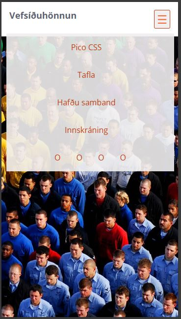
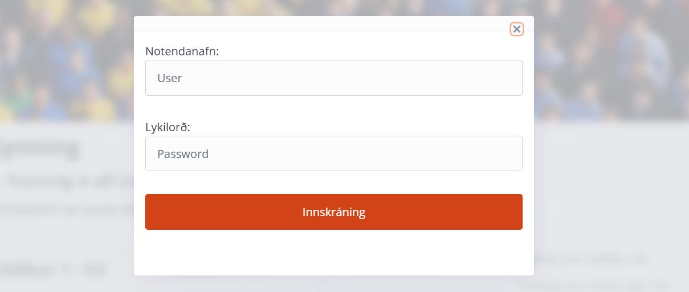
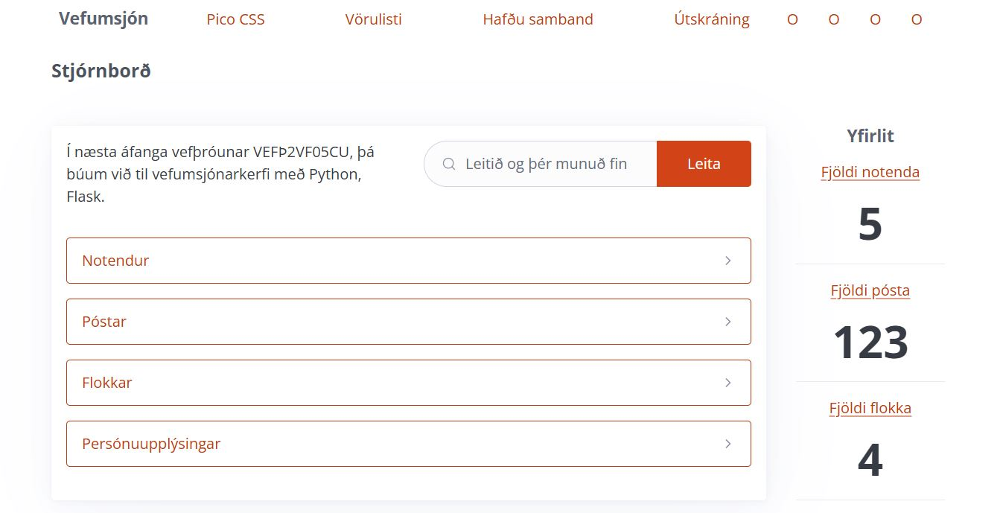
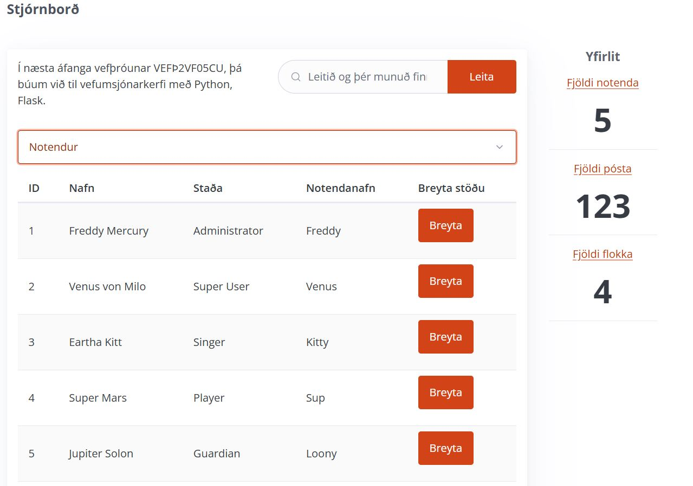
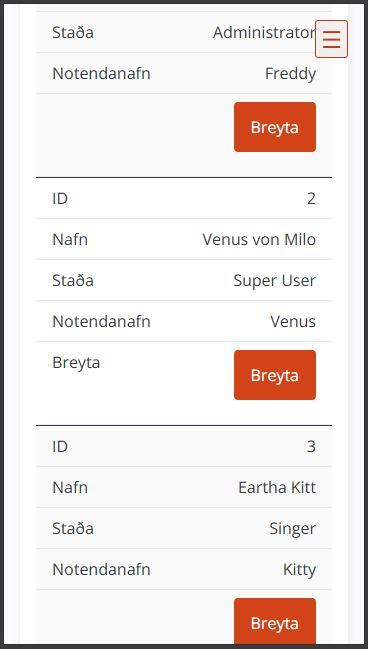

# **Complex Selectors**

### **Objective:**
Students gain an understanding of applying more complex styling methods in **CSS** to design better websites.

### **Dropdown Menu in the Table of Contents**

Now you are to create a **table of contents** for the website; assume there are several links included in the table of contents.

- On screens larger than **48em**, the table of contents should be **horizontal** at the top of the page with a **fixed** position.
- In smaller screen sizes (**20em – 48em**), the table of contents should be in a **dropdown menu**, and a **[≡]** button is at the top of the page.
- When the **[≡]** button is clicked, the table of contents appears, and it retracts when the button is clicked again.
- 
- Example: [https://tolvubraut.is](https://tolvubraut.is/)

### **Popup Window (Modal)**

- In the navigation (**nav**), there should be a link titled **Login** (*Innskráning*).
- When the link is clicked, a **popup window (Modal)** appears.
- The window must contain a **form** with input fields for **name** and **password**.
- 
- See more: [Pop up Modal](https://picocss.com/docs/modal)
- It must not be possible to submit the form without filling out the input fields.
- When **Login** is clicked, the user is redirected to a new website.
- `<form action="admin.html" method="get">` (*in VEFÞ2VF05CU, the form will be used properly*).
- 

### **Control Panel**

- On **"admin.html"**, you are to design the interface for a **website management system**.
- Information about each category should be placed in the `
` tag.
- Information about **Users** should be in a `<table>` within the `
` tag.
- 
- The table must be **flexible** (responsive).
- 

### **Assessment: 5%**

- **Dropdown menu** in the table of contents:
    - **[≡]** Icon that displays the menu.
    - All links visible in a single line at the top of the page in **60rem+** screen size.
- **Details list** (Accordion list).
- **Popup window** (Modal).
- **Admin html** page.

#### **Project Submission**

- Submit to **Inna/VEFÞ2VH05BU/Verkefni-2** in a **.zip** file.

#### **Grades will be published in Inna**

_Good luck!_

---

#### **Study Material**

* [Pico CSS](https://picocss.com/)
* [Complex Selectors](Námsefni-2/README.md)
* [Transition and Transform](Námsefni-2/Transition-Transform.md)
* [Pseudo-classes](Námsefni-2/pseudo-classes.md)
* [11 New CSS Features Every Browser Supports in 2025](https://www.youtube.com/watch?v=55uUK-iJeNM)

#### **Complex Styles - Complex Selectors**

* [Shayhowe: Complex Selectors](https://learn.shayhowe.com/advanced-html-css/complex-selectors/)
* [Popup Window (Modal)](https://picocss.com/docs/modal)
* [Accordion List: **Details & Summary**](https://picocss.com/docs/accordion)