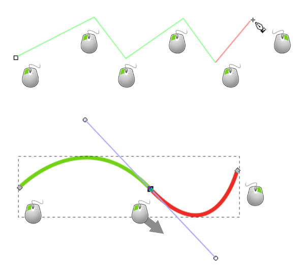
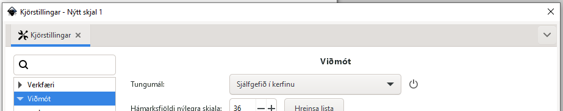
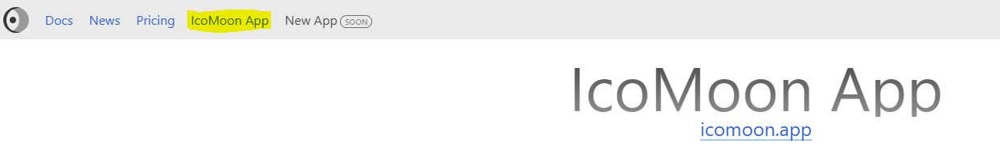
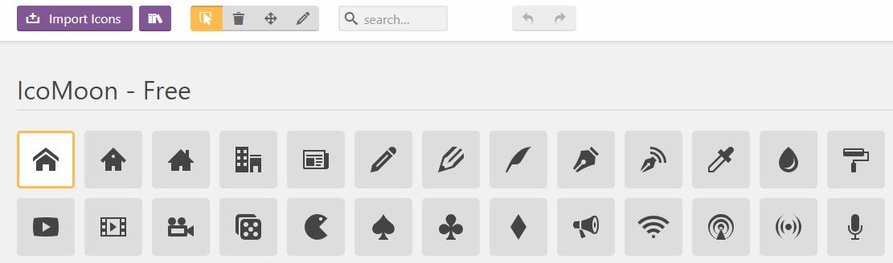
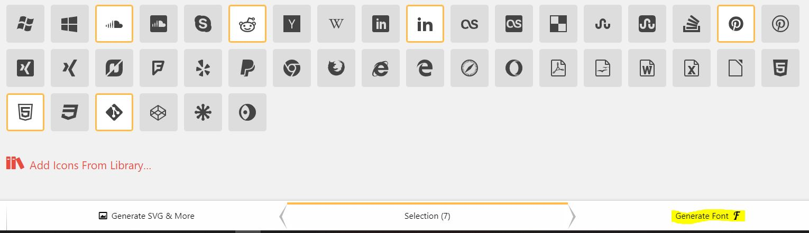
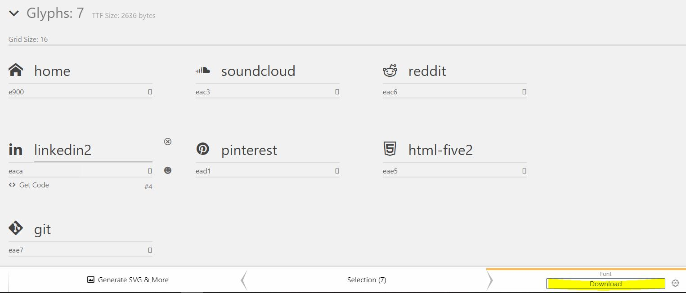
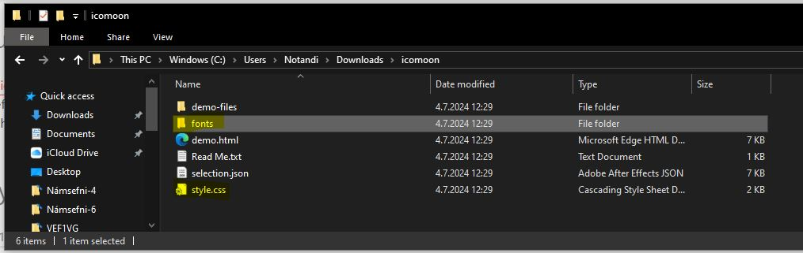

# Scalable Vector Drawing - Scalable Vector Graphics

- [What is Vector Art](https://www.linearity.io/blog/what-is-vector-art/)
- [Inkscape - The Pen Tool](https://inkscape-manuals.readthedocs.io/en/latest/pen-tool.html)
- Change interface language in Inkscape (_File > Preferences_)
  -  
  The program uses the language your computer is set to. You can change it here.

* **Inkscape**
  * [UI Design in Inkscape](https://manjitkarve.com/posts/inkscape-design-1/)
    * [Inkscape custom palette](https://manjitkarve.com/posts/inkscape-custom-palette/)
  * [Inkscape Custom Palette (YouTube video)](https://www.youtube.com/watch?v=Y1E8YWOB_Yc)
  * [How to add round corners (_border-radius_)](https://thepixelproducer.com/how-to-add-curves-or-round-corners-in-inkscape/)
  * [Inkscape tutorials](https://thepixelproducer.com/category/inkscape/)

#### Reading Material

* [Wikipedia - SVG](https://en.wikipedia.org/wiki/SVG)
* [SVG on the Web](https://svgontheweb.com/)
* [Using SVG](https://css-tricks.com/using-svg/)

---

## Icon Fonts

* [What is an Icon Font?](https://designshack.net/articles/typography/what-is-an-icon-font/)
* [Icomoon icon font](https://icomoon.io/)
* [How to use Icomoon fonts](http://chipcullen.com/how-to-use-icomoon-and-icon-fonts-part-1-basic-usage/)

When the Icomoon website opens, select ` IcoMoon App `. This takes you into a web app where you can choose the icons you want to use. The web app stores your selections in the browser cache (_cache_). The data is not stored on other computers or on a server.

You can also import your own vector icons into the app using (_Import Icons_). Selected icons are marked with a yellow outline.

When you have selected the icons you want to use, click ` Generate Font F `.

You will then see the icons with ID identifiers, and it shows how to display the icons on a website through CSS using `<> Get Code `. Next, download (_Download_) the icon font to your computer.

We then use the font files in the _fonts_ folder and the stylesheet _style.css_.

