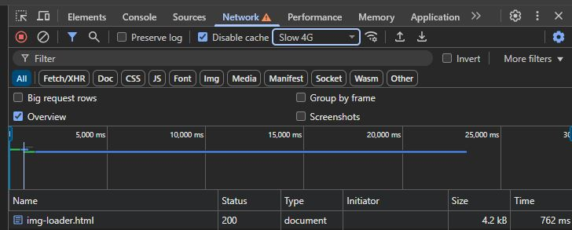

# Animation

* Use the following CSS properties as needed
  * _"transition"_
  * _"transform"_
  * _"animation"_

### Important Notice

Add a notice/banner to the website you have been working on in assignment 4. The notice should move across the screen from right to left.
[See more here](https://www.w3schools.com/css/css3_animations.asp)

### Slideshow

It is possible to create simple slideshows with CSS styles [see more here](https://www.w3.org/Style/Examples/007/slideshow.en.html)

### Spinner

When a large file is being downloaded from a server, it can be helpful to show the user that activity is in progress. This can be done with a moving SVG icon.

Create your own SVG spinner. You can use CSS animation to animate the SVG icon, or put the animation directly inside the SVG file.

Connect a large image to your webpage and add an animated icon that appears while the image is loading in the browser.
Wi-Fi connections are usually good in the capital area, so to see the spinner we need to set the browser to **"Slow 4G"** to simulate a poor network connection. Go to Inspector > Network > and select [Slow 4G] from the [_No throttling_] dropdown.

- [Example of a spinner shown while an image is loading in the browser](Námsefni-4/img-loader.html)
- [Example of how to create a spinner in an SVG file](https://www.fffuel.co/svg-spinner/)

### Interaction Animation - Transform Animation

Add an interaction animation to a button in the form on the front page.

- [See an example here](https://animate.style/)

#### Assessment 5%

- Text notice moves across the screen from right to left.
- Slideshow
- Interaction animation on a button (Transform animation)

#### Project Submission

Submit the website and stylesheets in Inna/VEFTH2VH05AU/Verkefni-4 as a **.zip** file.

#### Grades Will Be Published in Inna

_Good luck_

---

#### Reading Material

* [Animation (The Web Programming Book)](https://bok.vefforritun.is/19.kvikun)

#### Animation

* [W3Schools CSS Animation](https://www.w3schools.com/css/css3_animations.asp)
* [CSS transitions](https://developer.mozilla.org/en-US/docs/Web/CSS/CSS_Transitions/Using_CSS_transitions)
* [Animation timing function](https://developer.mozilla.org/en-US/docs/Web/CSS/animation-timing-function)
* [Animate Style](https://animate.style/)
* [Slideshow w3.org](https://www.w3.org/Style/Examples/007/slideshow.en.html#top)
* [Slideshow CSS](https://css-tricks.com/css-only-carousel/)
* [Cubic Bezier](https://cubic-bezier.com/)
* [Using Cubic Bezier](https://css-tricks.com/advanced-css-animation-using-cubic-bezier/)
* [CSS Scrolling text](https://blog.hubspot.com/website/scrolling-text-css)
* Animated symbols
  * [CSS &#9776; - X icon](https://www.w3schools.com/howto/howto_css_menu_icon.asp)
  * [Loader symbol](https://www.codingnepalweb.com/animated-loader-in-html-css/)
  * [Progress bar](https://www.codingnepalweb.com/button-progress-bar-html-css-javascript/)
* CodePen animation examples
  * [CodePen](https://codepen.io/rokobuljan/pen/XXzqKQ)
  * [CodePen](https://codepen.io/maheshambure21/pen/qZZrxy)
  * [CodePen](https://codepen.io/paulnoble/pen/ZYOzLG)
  * [CodePen](https://codepen.io/jaskiranchhokar/pen/wmGXav)
* [Number animation with CSS](https://css-tricks.com/animating-number-counters/#aa-the-new-school-css-solution)
* Collection pages
  * [CSS Text Animations](https://freefrontend.com/css-text-animations/)
  * [CSS3 slideshow example](https://codeshack.io/pure-css3-image-slideshow-example/)
  * [28 Slideshow examples](https://freefrontend.com/css-slideshows/)
  * [Splash screens](https://speckyboy.com/splash-screen-design/)

#### SVG Animation

* [A good start with SVG animation](https://artificial.design/archives/2018/05/23/svg-animation.html)
* [CSS Tricks - SVG animation](https://css-tricks.com/animating-svg-css/)
* [SVG Icons](https://webdesign.tutsplus.com/tutorials/how-to-animate-festive-svg-icons-with-css--webdesign-17658)

