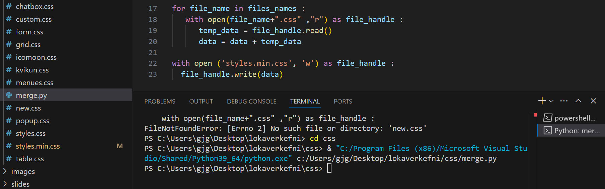

### Finishing

#### How to merge multiple CSS files into one file?

Create a Python file (for example, merge.py) in VS Code and save it in the CSS folder. Open the _Terminal_ and point the CLI to the CSS directory.



```python


files_names = [
   "new",
   "grid",
   "table",
   "form",
   "menues",
   "popup",
   "icomoon",
   "chatbox",
   "kvikun",
   "accordion",
   "custom" ]
data = ""

for file_name in files_names :
   with open(file_name+".css" ,"r") as file_handle :
      temp_data = file_handle.read()
      data = data + temp_data 

with open ('styles.min.css', 'w') as file_handle : 
  file_handle.write(data)

```

[How to merge multiple files in Python](https://stackoverflow.com/questions/68516922/how-to-merge-multiple-files-in-python)

##### CSS Code Compression _CSS Compressor_

* Install the Visual Studio Code extension called "CSS Compressor".
* To compact the code, use the command: `[shift]+[alt]+[f]`

#### Website on Github.io
* [Setting up a website on github.io](../uppsetning-github.io/README.md)

