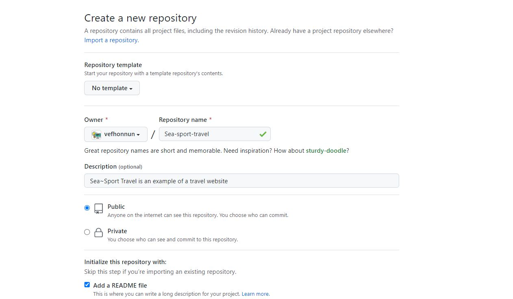
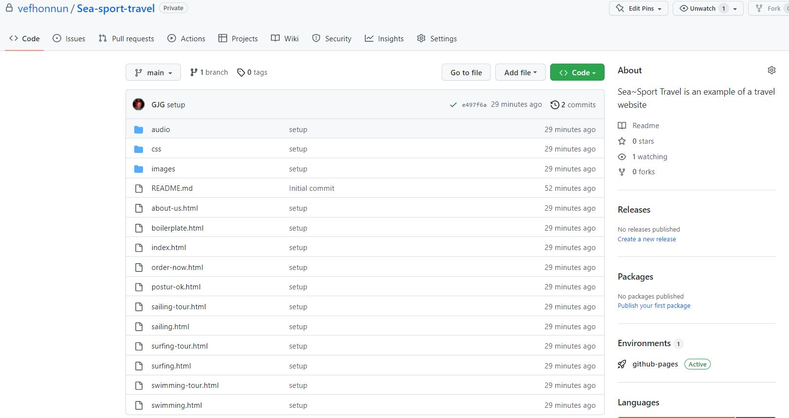
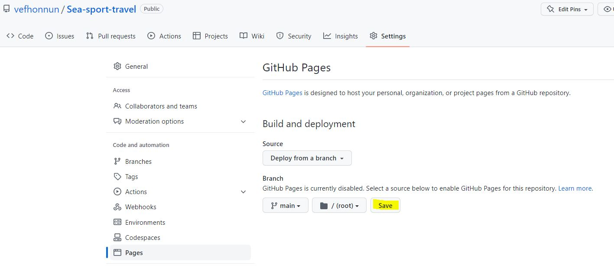
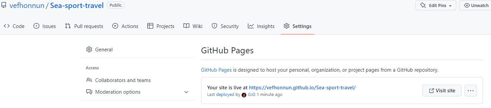

# Setting Up a Website on (username).github.io

GitHub allows users to create a website connected to their account. All you need to do is enable the web publishing connection in GitHub user settings (Settings).

Example:
1. Username on the GitHub account: **User**
1. Repository name: **username.github.io/_Repository_**
1. In the username.github.io repository -> top menu -> **Settings** -> **Pages**, select `Branch`: **_Main_**.
1. GitHub creates a connection between the repository and hosting on github.io.
1. You can now publish your assignments on your own website.

---

## Subdomain

If you want to create a subdomain with a different structure and look from _username.github.io_, it is relatively simple.

#### Example

1. Create a repository and name it after the project you want to publish.
    * 
    * The repository name must **not** contain Icelandic characters or spaces.
1. Clone the repository with `$ git clone ` and place the website you want to publish in the repository.
1. Push updates to GitHub.com with `$ git push `
    * 
1. At the top of the repository on GitHub.com, open _Settings_ and then select _Pages_ from the sidebar.
    * 
1. Here you can choose the repository as the root of the subdomain.
1. After a short time (2-3 minutes), you can refresh the Settings page.
    * 
1. Click the link and view your website.
    
#### [Example subdomain, vefhonnun.github.io/lokaverkefni/ ](https://vefhonnun.github.io/lokaverkefni/)

---

#### Git Bash Installation
* [Git Bash installation on PC](https://vefhonnun.github.io/verkefnaskil/git_innsetning.html)
