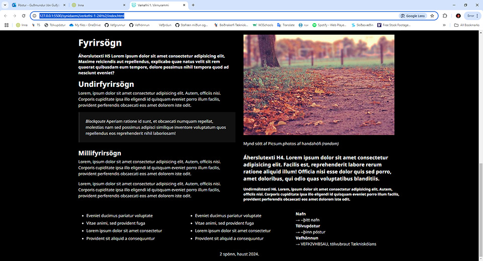
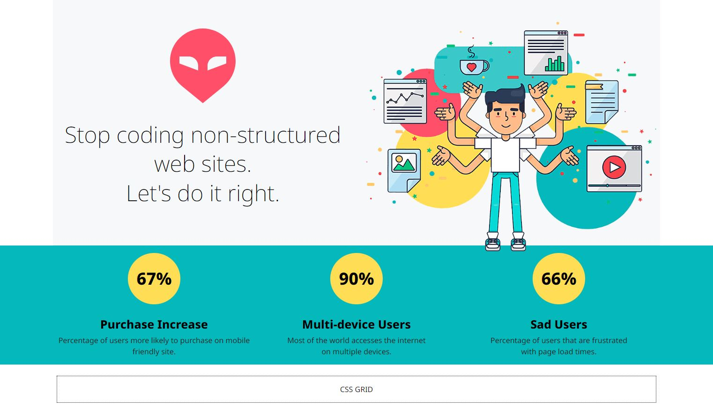

# CSS grunnsíða - _CSS boilerplate_

### Markmið:
Nemendur öðlast skilning á skipulagningu stílsíðukerfis og á hönnun CSS-grunnsíðu (Boilerplate) til að hanna betri vefsíður.

Þegar komið er að því að hanna vef með skipulögðum hætti er gott að geta stuðst við grunnkerfi þar sem búið er að hanna alla grunnþætti sem nota þarf í vef. Þar má nefna grindakerfi, sveigjanlega hönnun, litaval og leturnotkun.

Meðfylgjandi verkefni er HTML og CSS grunnsíða sem þú getur notað til að búa til þitt eigið grunnsíðukerfi. Vefurinn á að sýna skipulag og útlit vefsins.

* [New CSS - Boilerplate](Námsefni-1/new-css-boilerplate/)
  * [Vefsíða New.css](https://github.com/xz/new.css)
* [Verkefni 1 vinnugögn (.zip)](Námsefni-1/verkefni-1-nemendur.zip)

### Tvískipt litaþema

Hér er dæmi um vefsíðu þar sem vafrinn velur litaþema eftir því hvort notandi er með ljóst eða dökkt litaþema valið í honum. 

Litir í mynd eru settir í CSS litaþemað og gulur litur búinn til og settur í það.

### Grid dálkakerfi

### Svegjanleg hönnun

Farsímar (_Mobile_). Ein dálkabreidd á öllum grid klösum (1fr).

 

Spjaldtölvur (_laptops_). 6 dálkar skiptast rétt.

Fatölvur. Græni bakgrunnurinn teygist yfir skjáinn (_sérsnið - custom css_).

### Námsmat:  

#### Æfingaverkefni 5%

* Skipulag – Layout				
  * 2% Dálkaskipulag - Grid 
  *	1% Myndir aðlagast skjástærðum
* Útlit					
  * 2% CSS breytur - Litasamsetning
  * 1% Leturval - leturnotkun	

Vefsíðu og stílsíðu er skilað í _Innu/VEFÞ1VG/Verkefni-1_ í þjappaðri skrá, **Æfingar.zip**. 

#### Einkunn verður birt í Innu

#### Bjargir 

- [Námsefni 1. Grunnsíða til að vinna með (.zip skrá)](Námsefni-1/verkefni-1-nemendur.zip)

####  _CSS mini framework_

* [New.css](https://github.com/xz/new.css)
* [Portal - Minimal CSS](https://github.com/dohliam/dropin-minimal-css)

#### CSS breytur (_CSS Variables_)

* [CSS breytur W3Schools](https://www.w3schools.com/css/css3_variables.asp)
* [Moz:lla, CSS eigindi - CSS Custom Properties](https://developer.mozilla.org/en-US/docs/Web/CSS/Using_CSS_custom_properties)
* [Breytilegt litaþema](https://dev.to/fabiogiolito/create-a-color-theme-with-these-upcoming-css-features-4o83)
* [Create better themes with css variables](https://blog.logrocket.com/create-better-themes-with-css-variables/)
