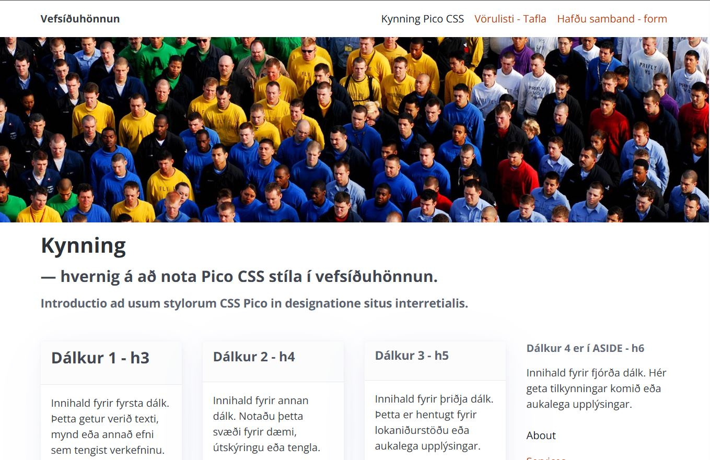
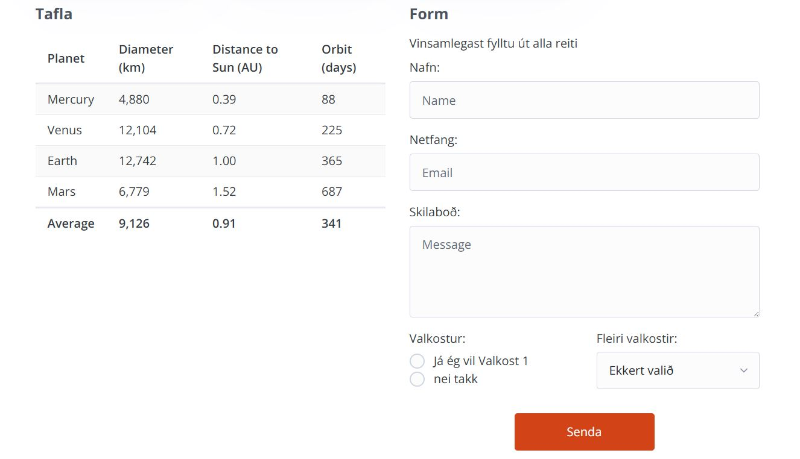

# CSS grunnsíða - _CSS boilerplate_
 
### Markmið:
- Nemendur öðlast skilning á skipulagningu stílsíðukerfis og á hönnun grunnvefsíðu (_Boilerplate_). 
- Hvernig hægt er að nota breytur í CSS stílsíðu.
- Hanna form og töflur í HTML

Þegar komið er að því að hanna vef með skipulögðum hætti er gott að geta stuðst við grunnkerfi þar sem búið er að hanna alla grunnþætti sem nota þarf í vef. Þar má nefna grindakerfi, sveigjanlega hönnun, litaval og leturnotkun.

Fyrir valinu er **Pico** stílsíðusafnið sem hægt er að nota án sérsniðinna klasa. Við kynnum okkur safnið og aðlögum að okkar eigin hönnun. Skoðum fyrst hvernig er hægt að nota safnið.

- [Pico stílsíðusafn (_CSS Framework_)](https://picocss.com/docs)

## Verkefni 1

Búum til vefsíðu og tengjum Pico safnið við síðuna. Við sækjum allan [_Pico_ pakkann](https://github.com/picocss/pico/archive/refs/heads/main.zip) af vefnum þeirra. Setjum innihaldið á okkar þróunarsvæði  og skoðum hvað hægt er að gera með stílsafninu. 

1. Veljum sér litaþema  
   - [Litaval](https://picocss.com/docs/colors)
   - ` <link rel="stylesheet" href="css/pico.<litaval>.css"> `
1. Pico velur ljóst eða dökkt litaþema eftir því hvernig notandi stillir vafrann sinn
   - [Ljóst eða dökkt litaþema](https://picocss.com/docs/color-schemes)

### Letur

- [Leturstillingar](https://picocss.com/docs/typography)
- [Tenglar](https://picocss.com/docs/link)
- [Hnappar](https://picocss.com/docs/button)
- [Tafla](https://picocss.com/docs/table)

### Grid dálkakerfi (_layout_)

Pico kemur með einfalt dálkakerfi og viðmiðunarkerfi (_@media breakpoints_). Notum eftirfarandi clasa til að búa til dálkaskipulagið.

- [Container](https://picocss.com/docs/container)
- [Grid](https://picocss.com/docs/grid)

### Sérstillingar

1. Náðu í aðra leturgerð af fonts.google.com og settu hana í staðinn fyrir leturgerðina en notuð er í Pico safninu. 
2. Settu forsíðumynd að eigin vali í vefsíðuna í ` picture ` tagið og hafðu myndina í þremur stærðum: litla (_small_), miðlungs (_medium_) og stóra mynd (_large_).

- [CSS variables](https://picocss.com/docs/css-variables)

#### Mynd á forsíðu

- Veldu mynd úr myndasafni (frjálst val) og hafðu hana í þremur mismunandi stærðum, Large, Medium og Small. 
  - Í VEFÞ1VG verkefni 6 var farið í hvernig vinna á myndir fyrir vef og þessi mynd á að setja í **&lt;picture>** tagið

Athugið að PICO er ekki með nein sérsnið fyrir myndvinnslu eða aðrar sérþarfir. 

- Til að nota sérniðna CSS stíla þá búum við til auka stílsíðu **_custom.css_** sem við tengjum við Html síðuna ásamt Pico safninu. 
- Tengið (_link_) Pico stílsíðuna á undan _"custom.css"_ í HTML/Head

#### Tafla  &lt;Table> 

Búðu til töflu í vefsíðunni, innhald töflunnar getur verið dagskrá af einhverju tagi.  
Skipulag html  töflu er með ósveigjanlegu sniði nema farið sé í sérniðnar lausnir. Í Pico er hægt að nota [Overflow auto](https://picocss.com/docs/overflow-auto) til að taflan riðli ekki skipulagi vefsíðunnar í litlum skjáum.

> Tabular Data &lt;td> er eina tagið sem er hannað til að sækja gögn af miðlara í hvert sinn sem vefsíða er opnuð, jafnvel þegar flett er á milli síðna. Það er mjög gagnlegt þegar um er að ræða upplýsingar sem þurfa að uppfærast daglega eða oftar.

> Töflur henta illa í útlithönnun ss til að birta texta og myndir sem breytast ekki. Vafrinn getur geymt slíkar upplýsingar í vinnsluminni sínu og þarf ekki að sækja þessi gögn í sífellu. "Table" tagið er erfitt að eiga við þegar kemur að sveigjanleika vefsíðu og best að nota það ekki nema þegar um gagnvirkar færslur er að ræða.  

* Notaðu thead, tbody og tfooter tögin í töflukóðanum. Í stílsíðu er hægt að nota gerviklasa (Pseudo class - nth-child) til að fá litskiptingu í bakgrunn töflunnar. 
* Taflan skemmir ekki skipulag vefsíðu (Overflow auto) í litlum skjáum. 

## Skráningarform 

Setjið skráningarform inn á vefinn ykkar, hafið samræmi í útliti formsins og töflunnar og í rökréttu samhengi við heildarútlit vefsins.  Formið á að vera sýnilegt í öllum helstu skjástærðum. 

* input -text, -email, -radio, -checkbox, select og textarea er í pöntunarformi 

#### Réttritun (_validation_)
Þegar smellt er á hnappinn (_input type:submit_) í skráningarforminu þá athugar (_validate_) vafrinn hvort texti sé rétt skráður í innsláttarreiti (_input_). Ef textinn uppfyllir ekki þau skilyrði sem eiga við þá á ekki að vera hægt að senda upplýsingar frá vefsíðunni (en ef allt er í lagi þá sendum við innsláttinn út í bláinn). 

` <input type=“x“ name=“x“ value=“X“ required placeholder=“fyllið út þennan reit“> `

---

### Námsmat: 15%

* Skipulag – Layout	2%			
  * Dálkaskipulag - Grid 
  *	Svegjanleg hönnun
* Útlithönnun 3%
    - Litasamsetning
    - Leturval - leturnotkun
    - Forsíðumynd í 3 mismunandi stærðum L, M, S.
* Tafla	5%
* Form	5%				
  * innsláttarreitir eru skilyrtir (_required_)	

Vefsíðu og stílsíðu er skilað í _Innu/VEFÞ1VG/Verkefni-2_ í **.zip** skrá. 

#### Einkunn verður birt í Innu

_Gangi þér vel_

---

### Bjargir

* [Pico _CSS mini framework_](https://picocss.com/docs)
* [Github Pico css](https://github.com/picocss/pico)

#### CSS breytur (_CSS Variables_)

* [CSS breytur W3Schools](https://www.w3schools.com/css/css3_variables.asp)
* [Moz:lla, CSS eigindi - CSS Custom Properties](https://developer.mozilla.org/en-US/docs/Web/CSS/Using_CSS_custom_properties)
* [Breytilegt litaþema](https://dev.to/fabiogiolito/create-a-color-theme-with-these-upcoming-css-features-4o83)
* [Create better themes with css variables](https://blog.logrocket.com/create-better-themes-with-css-variables/)

#### Töflur 	

* [Skipulagning gagna](http://learn.shayhowe.com/html-css/organizing-data-with-tables/)
* [Scope eigindið](https://www.w3schools.com/tags/att_scope.asp)
* [RWD tafla, Smitty](http://allthingssmitty.com/2016/10/03/responsive-table-layout/)
* [RWD tafla, CSS-tricks](https://css-tricks.com/responsive-data-tables/)

#### Form

*   [Building Forms](http://learn.shayhowe.com/html-css/building-forms/)
*   [Form moz:lla](https://developer.mozilla.org/en-US/docs/Web/HTML/Element/form)

#### Form validation

* [HTML &lt;input> pattern Attribute](https://www.w3schools.com/tags/att_input_pattern.asp)
* [W3Schools Form attributes](http://www.w3schools.com/html/html_form_attributes.asp)
* [Form Data Validation](https://developer.mozilla.org/en-US/docs/Web/Guide/HTML/Forms/Data_form_validation)
* [input date, time fix](https://stackoverflow.com/questions/14946091/are-there-any-style-options-for-the-html5-date-picker?newreg=23b233a466f14c6e851d6e948e96d7ee)

#### Annað
* [11 New CSS Features Every Browser Supports in 2025](https://www.youtube.com/watch?v=55uUK-iJeNM)

