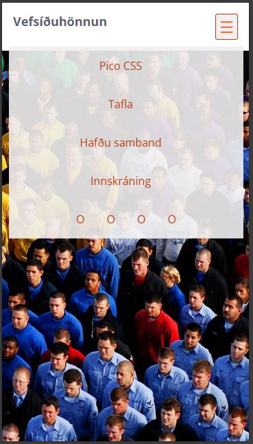
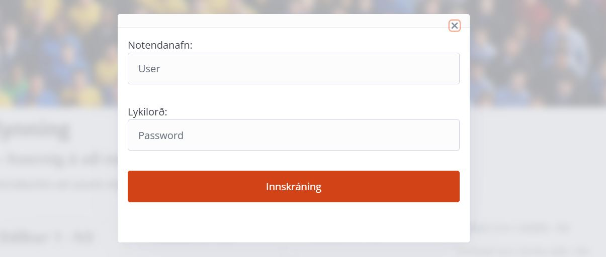
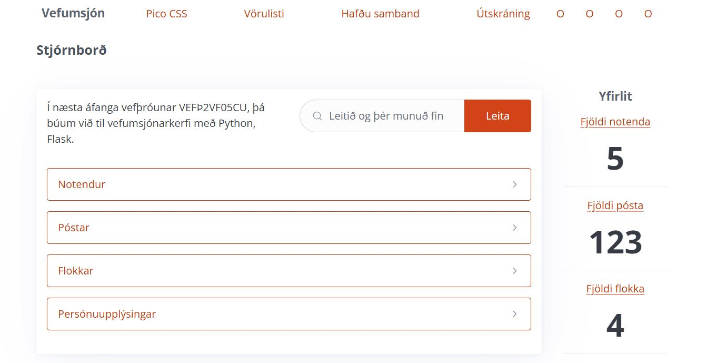
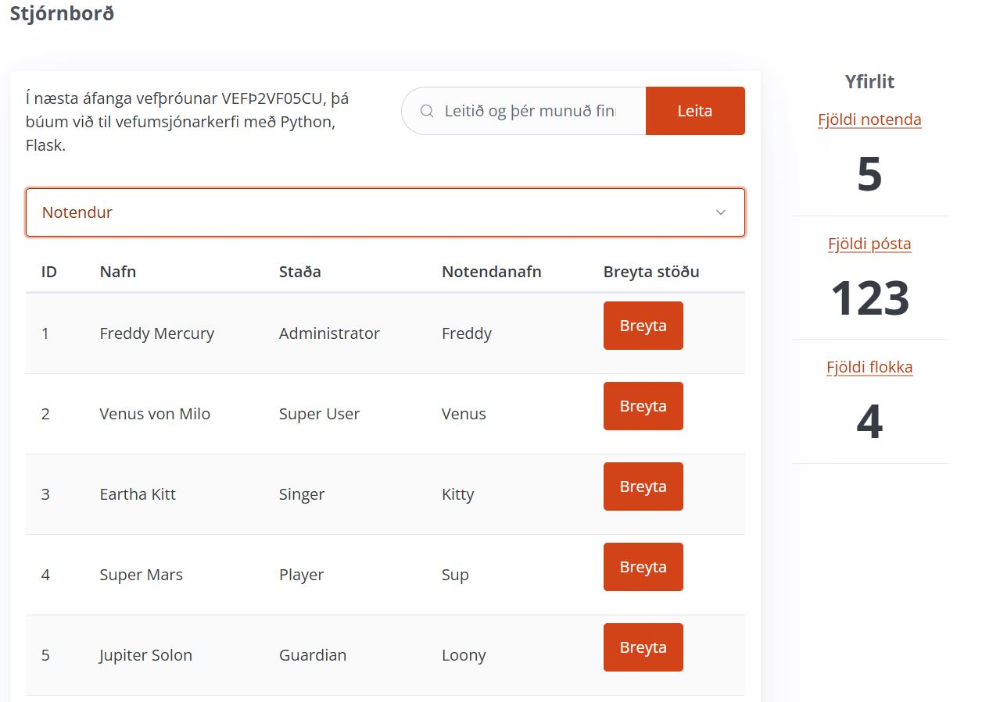
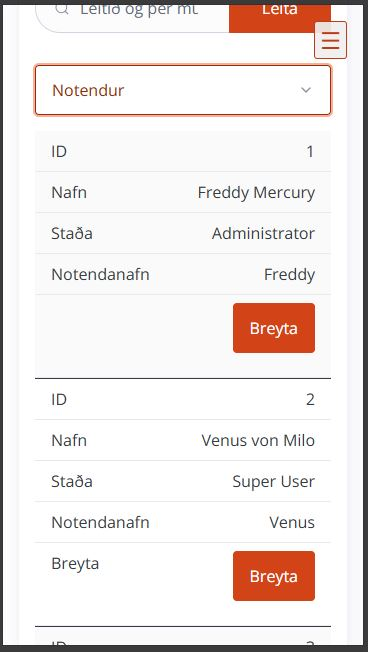

# Flókin stílbrögð 

### Markmið:
Nemendur öðlast skilning á að beita flóknari stílaðferðum í CSS til að hanna betri vefsíður. 

### Fellilisti í efnisyfirliti (_Drop down menu_)

Nú á að búa til efnisyfirlit á vefsíðuna, gerið ráð fyrir að það séu nokkrir tenglar (links) séu í efnisyfirlitinu.  
 
- Í skjáum stærri en 48em á efnisyfirlitið að vera lárétt efst á síðunni með fastri (_„fixed“_) staðsetningu
- Í minni skjástærðum 20em – 48em, á efnisyfirlitið að vera í fellilista (_drop down menu_) og [≡] hnappur er efst á síðunni
- Þegar smellt er á [≡] hnappinn þá birtist efnisyfirlitið og fer tilbaka þegar smellt er aftur á takkann. 
- 
- Dæmi: [https://tolvubraut.is](https://tolvubraut.is/)

### Sprettigluggi (_Modal_)

- Í efnisyfirlitinu (_nav_) á að vera tengill sem ber heitið **Innskráning**
- Þegar smellt er á tengilinn þá birtist sprettigluggi (_Modal_). 
- Í glugganum á að vera form með innsláttarreitum fyrir nafn og lykilorð
- 
- Sjá nánar: [Pop up Modal](https://picocss.com/docs/modal)
- Það á ekki að vera hægt að senda formið án þess að fylla út innsláttarreitina
- þegar smellt er á **innskráning** þá förum við á nýja vefsíðu
- ` <form action="admin.html" method="get"> ` (_í VEFÞ2VF05CU verður formið notað með réttum hætti_)
- 

### Stjórnborð

- Á "admin.html" á að útlitshanna viðmót á umsjónarkerfi vefs
- Upplýsingar um hvern flokk á að setja í tagið `details` 
- Upplýsingar um Notendur eru í `summary` taginu í `table`
- 
- Taflan á að vera sveigjanleg 
- 

### Námsmat, lykilmatsþáttur 20%

#### Æfingaverkefni 10%

-	4% Fellilisti í efnisyfirliti (_drop down menu_)
    -	[≡] Tákn sem birtir fellilista (Drop down menu)
    -	Allir tenglar sýnilegir í einni línu efst í vefsíðu í 60rem + skjástærð
- 3% Details list (_Accordion list_)
-	3%  Sprettigluggi (_Modal_)
       
 #### Tímaverkefni  10% 

 - Tímaverkefnið er lagt fyrir og unnið í lok 2. verkefnis (2 kennslustundir)
 - Lagt er fyrir texti og myndir sem á að nota í tímaverkefninu.
 - Nemendur nýta sér tæknilegar lausnir sem búið er að fara yfir í verkefnum 1 og 2. 

#### Verkefnaskil

-  _Inna/VEFÞ2VH05BU/Verkefni-2_  í **.zip** skrá.
   -  Í **.zip** skránni eiga að vera 2 möppur, með tímaverkefni og æfingaverkefni. 

#### Einkunn verður birt í Innu

_Gangi þér vel_

---

#### Námsefni

* [11 New CSS Features Every Browser Supports in 2025](https://www.youtube.com/watch?v=55uUK-iJeNM)
* [Complex Selectors](Námsefni-2/README.md)
* [Transition og transform](Námsefni-2/Transition-Transform.md)
* [Hulduklasar (_Pseudo classes_)](Námsefni-2/pseudo-classes.md)

#### Flóknir stílar - _Complex Selectors_

* [Shayhowe, Flóknar stílsetningar (_Complex Selectors_)](https://learn.shayhowe.com/advanced-html-css/complex-selectors/)
* [Sprettigluggi (_Modal_)](https://picocss.com/docs/modal)
* [Harmonikkulisti **Details & Summary**](https://picocss.com/docs/accordion)
