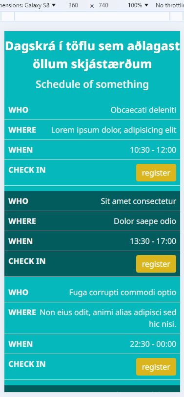
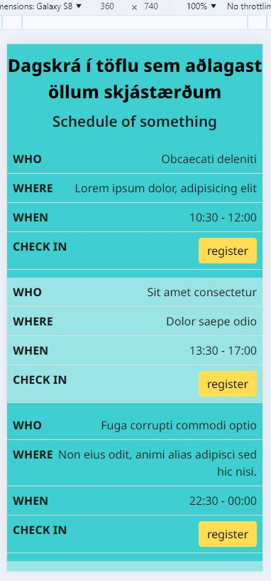
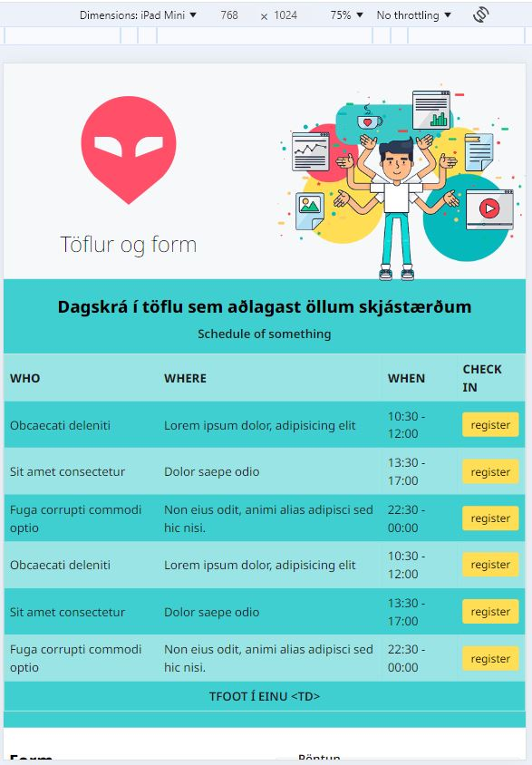
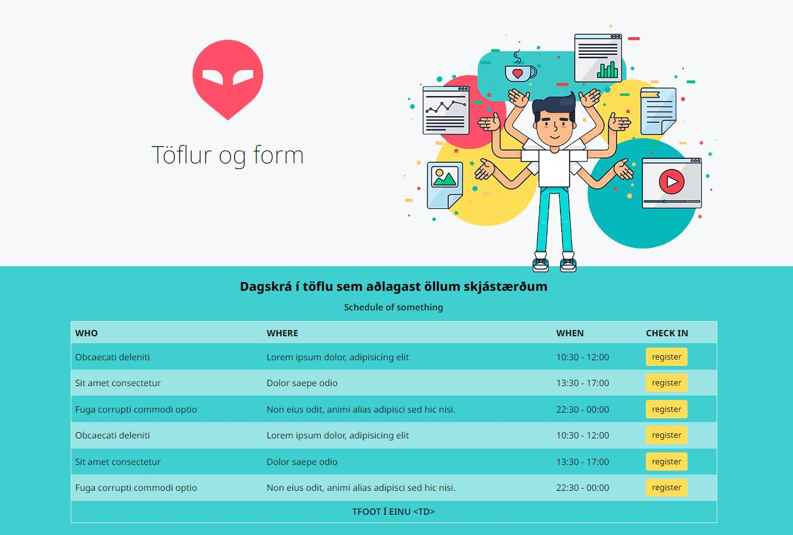
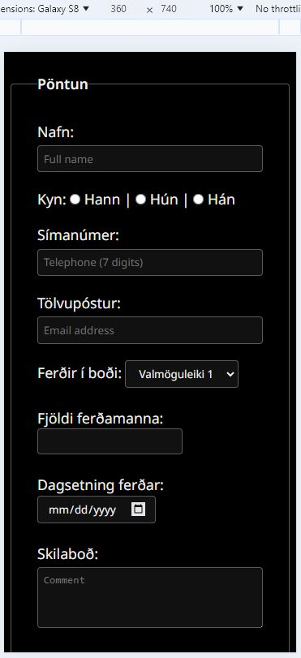
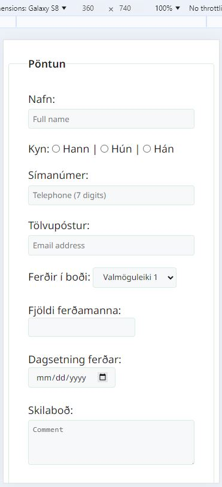
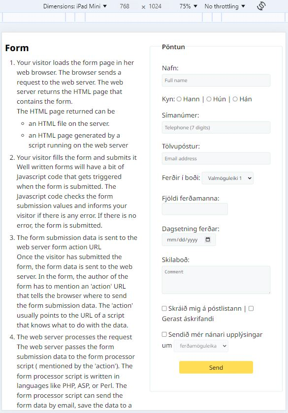
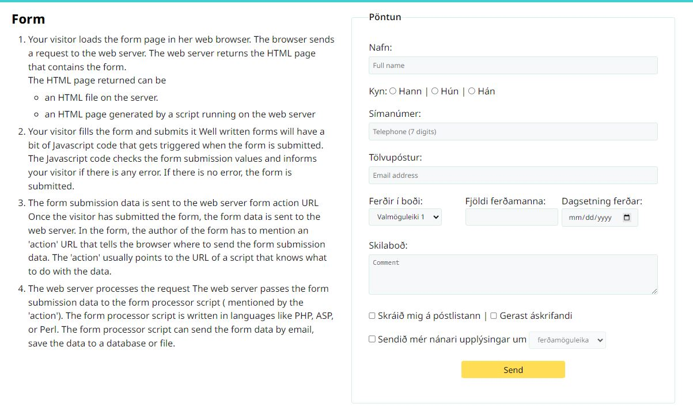

# Tafla  &lt;Table> 

Búðu til töflu í vefsíðu, innhald töflunar getur verið dagskrá af einhverju tagi. Til að byrja með má notast við _dummy_ texta. Vefsíðan á að vera sú sama og þú gerðir í 1. verkefni.

Taflan á að birtast í öllum skjástærðum án þess að fara út fyrir skjáinn.  

#### Viðmið 0 – 48rem (0 – 768px) Það á ekki að þurfa að hliðra til skjánum þegar taflan er skoðuð í farsímum.

 

Taflan á að vera í tvískiptu litaþema

#### Viðmið 48rem + (768px).

#### Viðmið 80rem + (1280px).

Tabular Data &lt;td> er eina tagið sem er hannað til að sækja gögn af miðlara í hvert sinn sem vefsíða er opnuð, jafnvel þegar flett er á milli síðna. Það er mjög gagnlegt þegar um er að ræða upplýsingar sem þurfa að uppfærast daglega eða oftar.

Töflur henta illa í útlithönnun ss til að birta texta og myndir sem breytast ekki. Vafrinn getur geymt slíkar upplýsingar í vinnsluminni sínu og þarf ekki að sækja þessi gögn í sífellu. "Table" tagið er erfitt að eiga við þegar kemur að sveigjanleika vefsíðu og best að nota það ekki nema þegar um gagnvirkar færslur er að ræða.  

---

## Skráningarform 

Setjið skráningarform inn á vefinn ykkar, hafið samræmi í útliti formsins og töflunnar og í rökréttu samhengi við heildarútlit vefsins.  Formið á að vera sýnilegt í öllum helstu skjástærðum. 
  
 

Formið á að vera í tvískiptu litaþema

#### Viðmið 48rem + (768px).

#### Viðmið 80rem + (1280px).

#### Réttritun (_validation_)
Þegar smellt er á hnappinn (_input type:submit_) í skráningarforminu þá athugar (_validate_) vafrinn hvort texti sé rétt skráður í innsláttarreiti (_input_). Ef textinn uppfyllir ekki þau skilyrði sem eiga við þá á ekki að vera hægt að senda upplýsingar frá vefsíðunni (en ef allt er í lagi þá sendum við innsláttinn út í bláinn). 

` <input type=“x“ name=“x“ value=“X“ required placeholder=“fyllið út þennan reit“> `

* Ekki er hægt að skilja nafnareit auðan 		
* Símanúmer verður að vera tölur (numbers)
* Tölvupóstfang verður að vera með @	      	
* Notið „input date“
* Notið „select option, checkbox og radio“. 	
* Notið aðra leturgerð og stærð í „textarea“

#### Tafla 

* Taflan inniheldur upplýsingar sem eru skiljanlegar og skilmerkilega settar upp.
* Notaðu thead, tbody og tfooter tögin í töflukóðanum. Í stílsíðu er hægt að nota gerviklasa (Pseudo class - nth-child) til að fá litskiptingu í bakgrunn töflunnar. 
* Taflan er svegjanleg (responsive) og skiptist þannig að hún er öll sýnileg
á litlum skjáum.

#### Form 
* input -text, -email, -radio, -checkbox, select og textarea er í pöntunarformi 
* Ekki á að vera hægt að senda (submit) form fyrr en skilyrðum (request)  eru uppfyllt í „text“, „email“, „date“ og „telephone“.

- **[Bjargir](https://github.com/vefhonnun/24H-verkefni/wiki#t%C3%B6flur)**

### Námsmat: 10%

* Tafla	5%
  * aðlagast skjástærðum
* Form	5%				
  * aðlagast skjástærðum
  * innsláttarreitir eru skilyrtir (_required_)	

Vefsíðu og stílsíðu er skilað í _Innu/VEFÞ1VG/Verkefni-2_ í **.zip** skrá. 

#### Einkunn verður birt í Innu

_Gangi þér vel_

