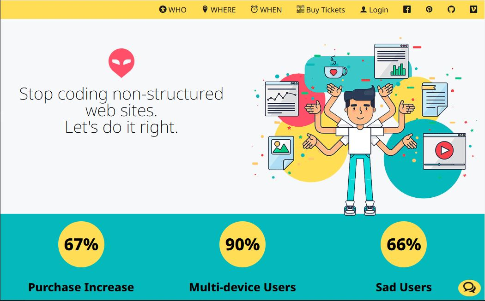

# SVG vigurteikning - _Scalable Vector Graphics_

Vigurteikning er XML vektormyndasnið til að skilgreina tvívíddar grafík. Vigurteikningar eru notaðar í öllum leturgerðum (_fonts_) í tölvunni þinni og flest táknin sem þú sérð í símanum þínum eru vigurteikningar.

Búið til einfalt SVG firmamerki (logo),  og setjið það inn á vefsíðu. Firmamerkið á að  vera staðsett efst á vefsíðunni. Látið lógóið skalast eftir viðmiðunarmörkum (breakpoints) í stílsíðu. 

Lógóið er hægt að teikna í [InkScape](https://inkscape.org/release/inkscape-1.2.2/) vektorteikniforritinu

## Icomoon táknletur

Táknletur er safn tákna sem hefur verið sett í leturgerð (_font_) og hægt er að nota á sama hátt og aðrar leturgerðir í vafra. Helstu ástæðurnar fyrir því að nota táknletur eru að þú getur breytt stærð, lit, lögun á auðveldan hátt, `font-size:` og `color:`. 

Setjið saman ykkar eigið táknletur (icon fonts). Það er hægt að gera það á [Icomoon.io](https://icomoon.io/) vefsíðunni.  Eftir að hafa flutt táknin yfir til ykkar. Þá er hægt að meðhöndla það eins og venjulega leturfjöldskyldu (font-family) á vefsíðu. Notið táknin í efnisyfirlitið og &lt;footer> félagsmiðlatengla (_Social Media_).  

* Sækið táknletrið með því að smella á „Generate Font“
* Mappan sem Icomoon hleður inn á tölvuna þína inniheldur „style.css“ og „font“ möppu með leturtáknunum sem þú valdir. Afritaðu „style.css“ og „font“ möppuna
* Demo.html síðan sýnir þér hvernig hægt er að setja táknin á vefsíðu.
* Það er hægt að meðhöndla táknin eins og venjulega leturfjöldskyldu (font-family) á vefsíðu. 

_Veljið tákn sem passa við ykkar efnisyfirlit_

- 
- [Námsefni](Námsefni-3/README.md)

### Námsmat 10%:  

- 5% SVG tákn - lógó teiknað í vektor teikniforriti (_inkScape_)
- 2.5% Icomoon táknletur (_iconfont_) með innfluttu tákni
- 2.5% Táknletur sett í HTML síðu. Mismunandi tákn í efnisyfirliti og &lt;header>

#### Verkefnaskil

- SVG tákn  
- Vefsíðu og stílsíðum er skilað í _Innu/VEFÞ1VG/Verkefni-4_ í **.zip** skrá.

#### Einkunn verður birt í Innu

_Gangi þér vel_

---

#### Skalanleg vigurteikning - Scalable Vector Graphics

* [W3schools, SVG in HTML](https://www.w3schools.com/graphics/svg_intro.asp)
* [InkScape teikniforritið](https://inkscape.org/)
  * [InkScape leiðbeiningar](https://liljaeysteinn.weebly.com/inkscape/ymsar-goar-leibeiningar-fyrir-inkscape/)
  * [InkScape Trace Bitmap Image](https://www.youtube.com/watch?v=aVPV6AtjGBg)
  * [Inkscape custom palette](https://manjitkarve.com/posts/inkscape-custom-palette/)
  * [Inkscape Custom Palette (YouTube video)](https://www.youtube.com/watch?v=Y1E8YWOB_Yc)
  * [How to add round corners (_border-radius_)](https://thepixelproducer.com/how-to-add-curves-or-round-corners-in-inkscape/)

#### Leturtákn - Iconfont

* [Icomoon táknletur](https://icomoon.io/)
* [How to use Icomoon fonts](http://chipcullen.com/how-to-use-icomoon-and-icon-fonts-part-1-basic-usage/)
* [SVG tákn safn](https://www.svgrepo.com/)
* [6 táknletur tól](https://www.webfx.com/blog/web-design/icon-font-generators/)

