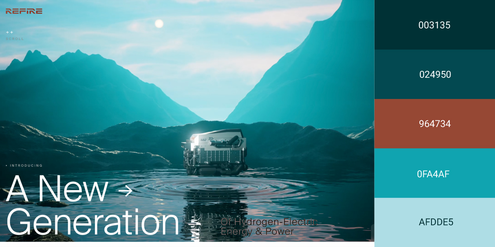
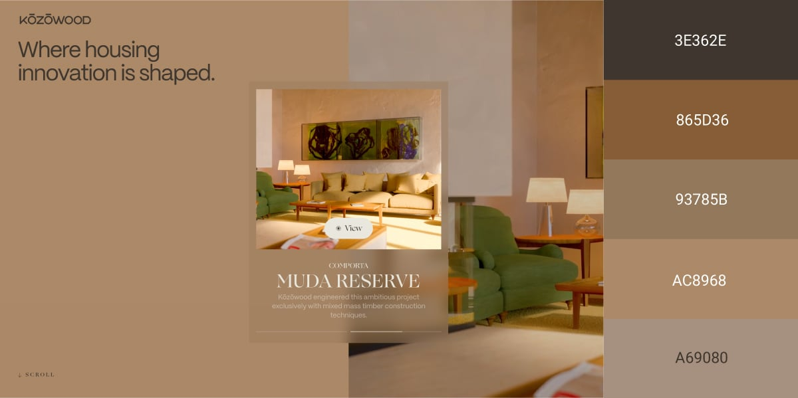
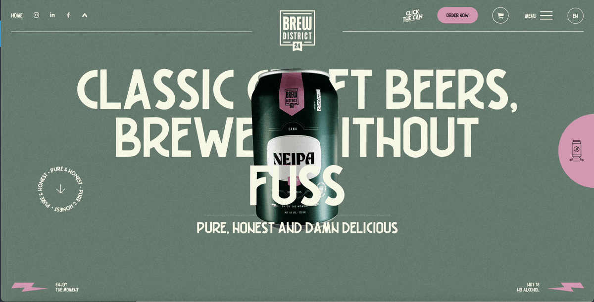
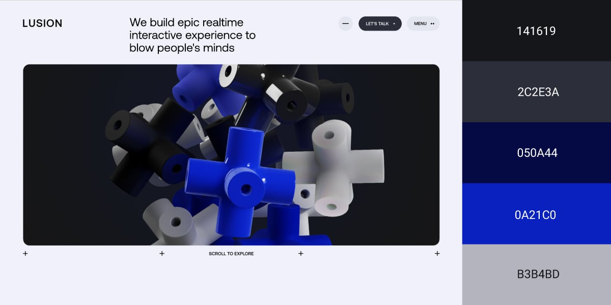
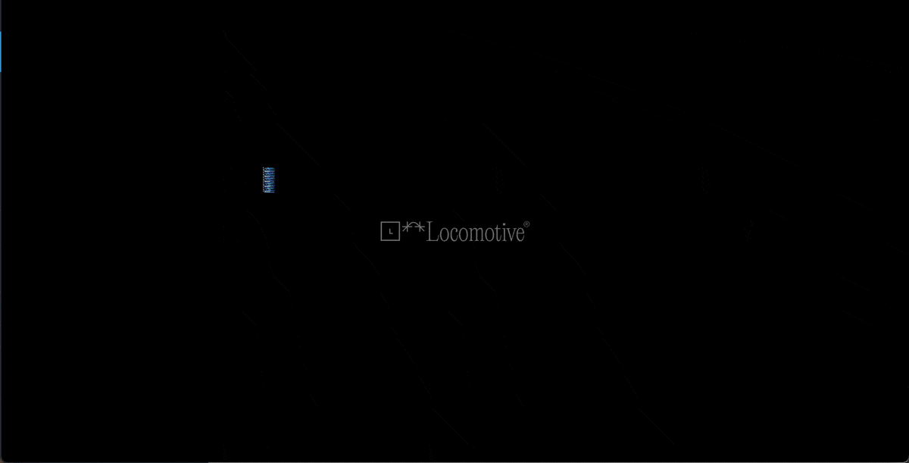
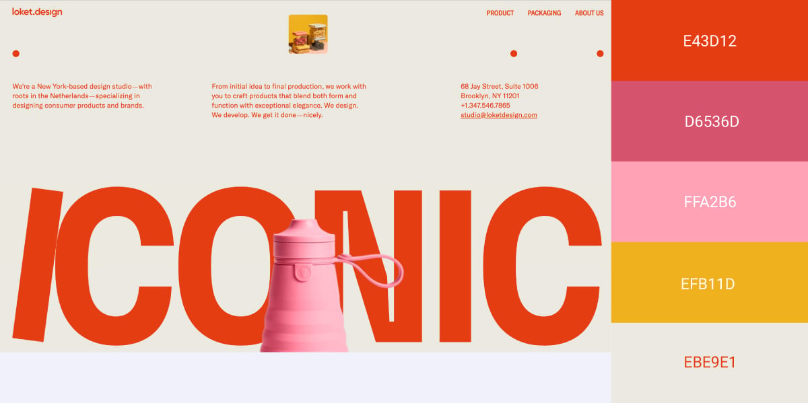
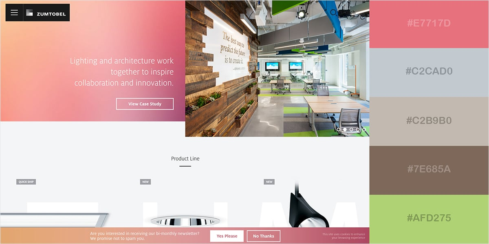
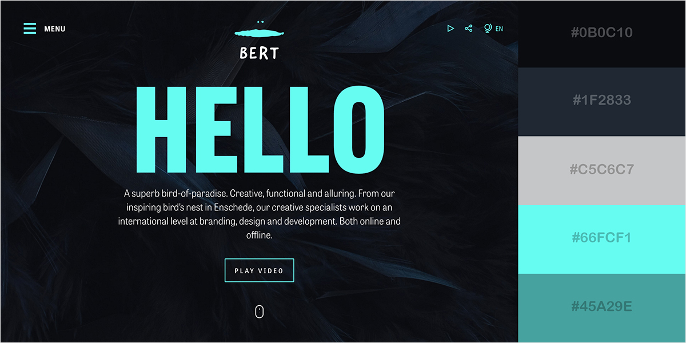
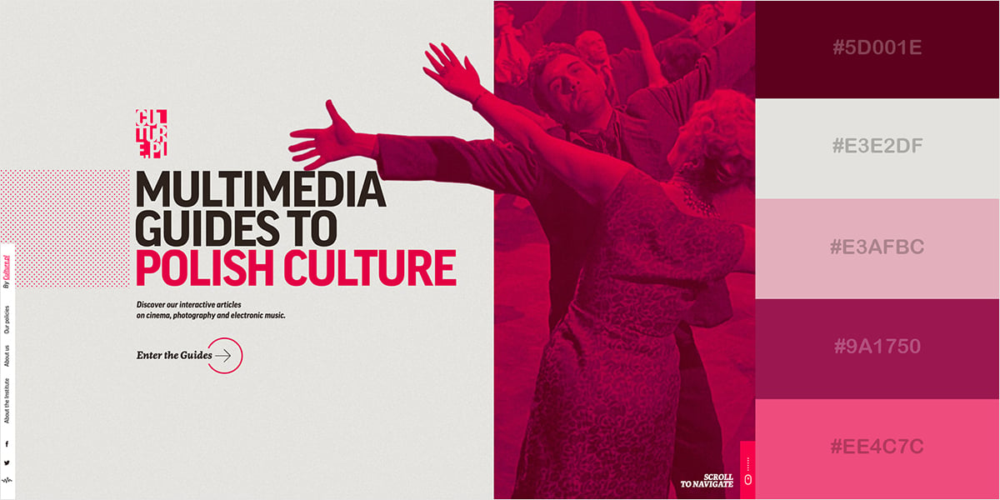

# Litaþemu fyrir vefsíður

Pico stílsíðusafnið býður upp á litaþemu sem hægt er að nýta í lokaverkefninu, [sjá nánar hér.](https://picocss.com/docs/colors)

1. Hér eru vefsíður þar sem litaval gefur innihaldi þeirra meira vægi.   

1. **Metallic Chic**   
1. **Deep Vintage Mood**   
1. **Cool and Collected**   
1. **Earthy and Serene**   
1. **Texture and Contrastc**   
1. **Mechanical and Floaty**   
1. **Pixel Intensity**   
1. **Gradient Pop**   
1. **Cosmic Artistry**   
1. **Vibrant but Calm**   
1. **Lively and Inviting**   
1. **Striking and Simple**   
1. **Red and Lively**   
1. **Artsy and Creative**   
1. **Elegant Yet Approachable**   
1. **Sleek and Futuristic**   

Heimild: https://visme.co/blog/website-color-schemes/ 
