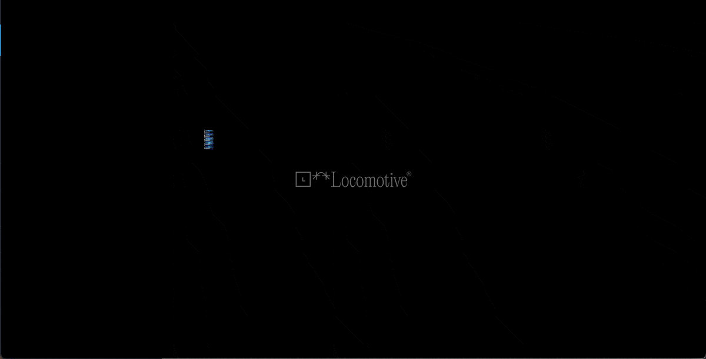

# Litaþemu fyrir vefsíður

1. Hér eru litaþemu sem hægt er að hafa til hliðsjónar þegar efni vefs hefur verið valið. Rétt litaval getur aukið sjónræn áhrif vefsíðu.
1. **Metallic Chic**   
1. **Deep Vintage Mood**   
1. **Cool and Collected**   
1. **Earthy and Serene**   
1. **Texture and Contrastc**   
1. **Mechanical and Floaty**   
1. **Pixel Intensity**   
1. **Gradient Pop**   
1. **Cosmic Artistry**   
1. **Vibrant but Calm**   
1. **Lively and Inviting**   
1. **Striking and Simple**   
1. **Red and Lively**   
1. **Artsy and Creative**   
1. **Elegant Yet Approachable**   
1. **Sleek and Futuristic**   

Heimild: https://visme.co/blog/website-color-schemes/ 